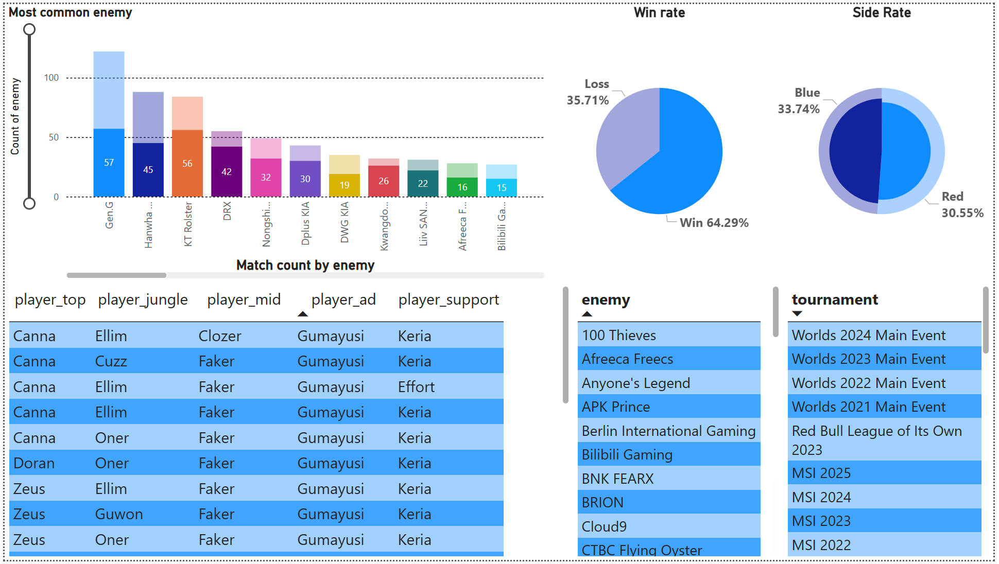
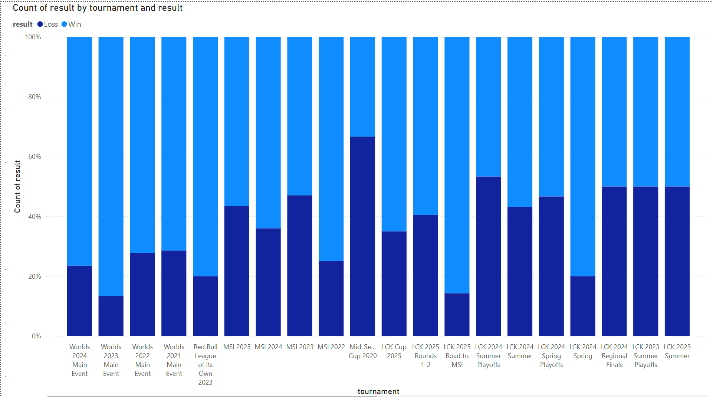

# T1 Analysis

## Project Overview
T1 Analysis is a personal project aimed at crawling data and learning data analysis by building a dashboard to showcase the performance of my favorite esports team, T1.

## Project Description
- Used **Scrapy** to collect data from the [lol.fandom](https://lol.fandom.com) website.
- Improved the scraper to run periodically every week, ensuring data is updated with the latest information.
- Used **Python** to clean, filter, and standardize the collected data for analysis.
- Loaded the processed data into **Power BI** to create interactive charts and generate actionable insights.

## Technologies Used
- Scrapy for web scraping
- Python for data processing
- Power BI for data visualization and dashboard creation


This project demonstrates a full data analysis workflow from data collection, cleaning, to visualization, providing meaningful insights about the esports team T1.

---

# Usage Instructions

## 1. Environment Setup
- Use your existing Python virtual environment to run the project.

## 2. Web Scraping
- This script automatically scrapes and updates new information compared to the existing data.
- Run the following command to start scraping:
``` bash
scrapy crawl lolfandom -o Output/matchHistory.csv
```


## 3. Data Cleaning and EDA
- Open and run the Jupyter notebook `EDA/RawDataEDA.ipynb` to see the data cleaning process and how data is organized.

## 4. Reporting and Dashboard
- Import the output CSV from `EDA/RawDataEDA.ipynb` into Power BI.
- Power BI will automatically group data by type for visualization.
- Feel free to explore your cleaned and transformed data and discover interesting insights.


# Some dashboard






# My own insign

- Improving performance toward the end of the year
- Frequent picks of Azir, Xin Zhao, and Varus in their lineup
- Strong dislike for Maokai and Vi.